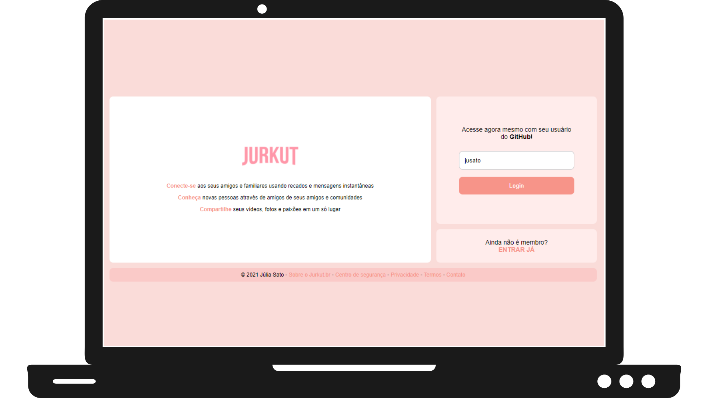
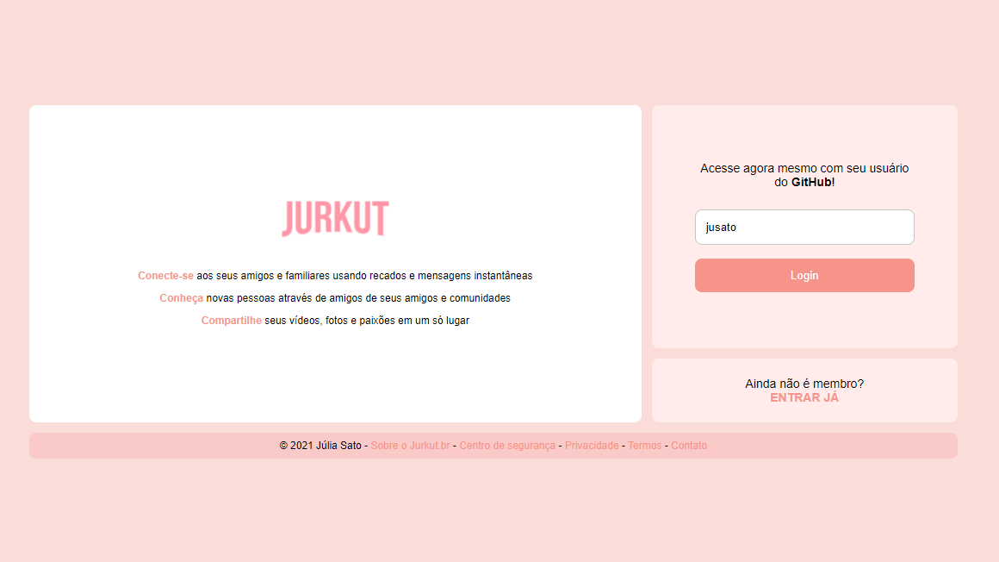
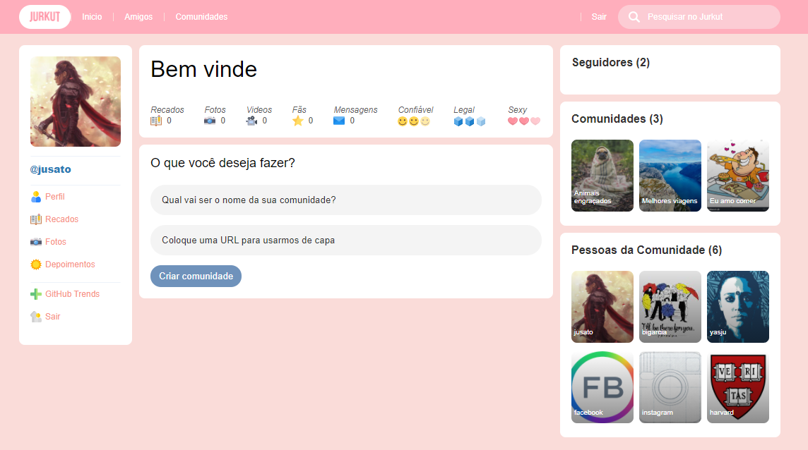

<h1 align="center">
  
</h1>
<br>
<br>
<p align="center">
  
</p>
<br>

**Jurkut** is an Orkut-based web application. It brings a more modern interface and uses better development tools.

_This project was developed during the #ImersãoReactAlura._

### Login page

- Log in with GitHub username.

<p align="center">
  
</p>

### Profile page

- View your followers (GitHub followers);
- View the communities you participate in;
- View the people who participate in these communities;
- Create a new community;
- Log out.

<p align="center">
  
</p>

## Technologies
<p align="left"> <a href="https://www.w3schools.com/css/" target="_blank">  </a> <a href="https://www.w3.org/html/" target="_blank">  </a> <a href="https://developer.mozilla.org/en-US/docs/Web/JavaScript" target="_blank">  </a> <a href="https://nodejs.org" target="_blank">  </a> <a href="https://reactjs.org/" target="_blank">  </a> <a href="https://git-scm.com/" target="_blank">  </a> <a href="https://www.figma.com/" target="_blank">  </a> </p>

## How to use
Required software:
- [Node.js](https://nodejs.org/)

```bash
# Clone project
$ git clone https://github.com/jusato/jurkut

# Install dependencies
$ npm install   #or yarn
```
_You can also access it directly in your browser: [Jurkut](https://jurkut.vercel.app/login)_
